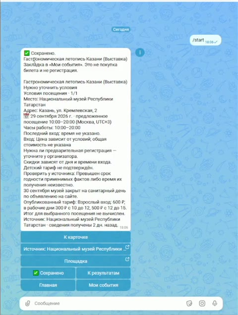

# Культурный план — события и личные закладки в MAX

**11 городов · 26 источников · 858 событий** — измерение каталога **28.09.2026**. [Открыть бота](https://max.ru/t432_hakaton_max_bot) · [Версии и определения](docs/DEFENSE_FACTS.json) · [Презентация](presentation/cultural-plan-submission-preview.pdf).

Бот подбирает культурные события по городу, дате, времени, составу посетителей и общему бюджету. Карточка показывает известную стоимость, условия, источник и дату получения сведений. Неопределённые варианты открываются отдельно. Выбор можно сохранить в «Мои события» и вернуться к нему позже.

**Город → дата и время → взрослые и дети → бюджет и тема → карточка и источник → сохранить.** Есть «Любая дата», «Любое время», ручной ввод и тип события после названия. Закладка сохраняет конкретное посещение и состав, не покупает билет. `/delete_data` удаляет личные параметры и закладки после подтверждения.

## Видеодемонстрация

[](https://youtu.be/VrJKhSaelgI)

[▶️ Смотреть видеодемонстрацию на YouTube](https://youtu.be/VrJKhSaelgI) · [📹 MP4 в репозитории](docs/demo/cultural-plan-demo.mp4)

## Демо без токена MAX

Нужны Docker Desktop с Linux-контейнерами и Compose v2 или новее. Команды PowerShell выполняются из корня репозитория; Node и Python на компьютере для запуска не нужны.

```powershell
docker compose up --build -d --wait
```

Демо использует вымышленные события, тестовую дату 05.04.2030 и симулятор MAX. После сборки сеть для него не нужна. Автоматический проход через подбор, карточку и сохранение:

```powershell
docker compose exec app node dist/scripts/organizer-check.js
```

Проверка возвращает `PASS`, `transport: SIMULATED_MAX`; доступность процесса — [localhost:3000/healthz](http://127.0.0.1:3000/healthz). Отдельного веб-интерфейса нет. При занятом порте перед запуском задайте `$env:DEMO_PORT = '33027'` и используйте этот порт в адресе.

## Подключение к настоящему MAX

**Для независимого запуска нужен токен бота, которым вы управляете, и отдельная копия репозитория.** Обычному пользователю бота токен не нужен. Владелец получает токен в настройках своего бота на [платформе MAX](https://business.max.ru); [официальная справка](https://dev.max.ru/help/chatbots). Токен хранится только в локальном файле и передаётся уполномоченным получателям через закрытый канал.

**1. Сохраните токен своего бота** одной строкой UTF-8 в `secrets/max_bot_token`, без кавычек и расширения `.txt`:

```powershell
Remove-Item Env:COMPOSE_PROJECT_NAME -ErrorAction SilentlyContinue
New-Item -ItemType Directory -Path secrets -Force | Out-Null
if (-not (Test-Path -LiteralPath secrets/max_bot_token)) {
    New-Item -ItemType File -Path secrets/max_bot_token | Out-Null
}
notepad.exe secrets/max_bot_token
```

Compose монтирует файл только для чтения как `/run/secrets/max_bot_token`; значение не попадает в Git, `.env` или параметры сборки.

**2. Подготовьте официальный CA и определите identity бота:**

```powershell
docker compose -f compose.setup.yaml run --build --rm setup node /app/dist/scripts/setup-max-ca.js
$env:NODE_EXTRA_CA_CERTS_CONTAINER = '/run/secrets/max-official-root.pem'
docker compose -f compose.setup.yaml run --rm setup
```

Первая команда получает официальный корневой сертификат, проверяет закреплённый отпечаток и срок. Хранилище Windows не меняется. Инициализация выполняет `GET /me` и `GET /subscriptions`, создаёт `.env.public` с точным ID, портом, своим Compose project и контейнерным путём CA. Существующий файл не перезаписывается. `botUrl` в выводе — ссылка **вашего** бота. У выбранного бота должен быть один потребитель; существующие webhook-подписки сохраняются.

**3. Запустите бота одной командой:**

```powershell
docker compose --env-file .env.public -f compose.polling.yaml up --build
```

Docker собирает приложение, автоматически подготавливает проверенный реальный каталог и затем запускает polling. При первой установке используется свежий комплект из образа. При обновлении более новый проверенный комплект устанавливается автоматически; более свежие операторские данные сохраняются. Если пригодных свежих событий нет, подготовка выполняет ограниченное обновление существующих источников, переиспользуя свежий кеш. Сетевая часть занимает не более двух минут; при недоступности источников команда сообщает, как повторить запуск, до подключения к MAX.

После `catalog_prepared` и `polling_started` откройте свой `botUrl`. `NODE_EXTRA_CA_CERTS` передаётся до запуска Node; обычные запросы ограничены 5 секундами, long polling — 30 секундами с клиентским deadline 35 секунд. [Подробности настройки и самопроверки](docs/ORGANIZER_CHECK.md).

## Остановка, перезапуск и хранение

Демо: `docker compose down`; повторный запуск — команда демо выше. Реальный polling: **Ctrl+C** в его терминале; повторный запуск — та же команда `up --build`. Она снова проверяет каталог, не загружая повторно неизменившиеся свежие данные.

Именованный том сохраняет SQLite, личные закладки, параметры, MAX cursor и каталог. Используйте прежние `.env.public` и имя проекта. `down` сохраняет тома; `down -v` удаляет данные и для обновления не нужен. До 50 закладок хранятся до удаления; параметры — до 30 дней без активности. [Приватность и восстановление](docs/PRIVACY.md).

Для постоянного размещения поддерживается **Webhook через HTTPS**: [профиль](deploy/compose.public.yaml), [настройка оператора](docs/ORGANIZER_CHECK.md#постоянный-webhook). Он использует ту же автоматическую подготовку каталога.

## Каталог и условия использования

Снимок 28.09.2026: **858 событий, 1 041 посещение** — 985 сеансов и 56 выставочных периодов. Казань, Екатеринбург, Санкт-Петербург, Новосибирск, Нижний Новгород, Самара, Пермь, Челябинск, Уфа, Красноярск и Москва. [Все 26 источников](docs/SOURCE_INVENTORY.md).

Это датированный срез части афиш. Неизвестные тарифы, часы и допуск показываются как условия для уточнения у учреждения; сохранение не заменяет билет или регистрацию. Свежесть каждого применимого наблюдения — 72 часа. Подготовка при запуске не продлевает этот срок: просроченные источники не участвуют в выдаче. Ограниченный bootstrap восстанавливает доступную часть афиши; полное обновление и расписание обслуживания задаёт оператор. [Обслуживание и обновление](docs/CATALOG_OPERATIONS.md), [границы измеренного набора](docs/DEFENSE_BRIEF.md).

## Устройство и комплект сдачи

MAX → проверка доступа → сохраняемая очередь входящих → подбор по каталогу → SQLite и очередь ответов → MAX. Каталог организован по городам и источникам. Node.js 22.23.2, TypeScript, Fastify, better-sqlite3 и Zod; зависимости и базовые Docker-образы закреплены версиями.

| Окружение | Значение |
|---|---|
| `APP_MODE` / `APP_INGRESS` / `ADMISSION_MODE` | Реальный профиль: `live` / `polling` / `PUBLIC`; демо: `local` / `webhook` / `PUBLIC` |
| `FLOW_DATA_MODE` | Реальный профиль: `real`; демо: `synthetic-test` |
| `MAX_EXPECTED_BOT_ID` / `MAX_CONSUMER_PORT` / `COMPOSE_PROJECT_NAME` | Создаются инициализатором своего бота; сохраняются при обновлении |
| `MAX_BOT_TOKEN_FILE` / `NODE_EXTRA_CA_CERTS_CONTAINER` | `/run/secrets/max_bot_token` / `/run/secrets/max-official-root.pem` |
| `DATABASE_PATH` | Реальный polling: `/app/runtime/public.sqlite` в постоянном томе |

Порты: демо — localhost `3000` (либо `DEMO_PORT`), приложение внутри контейнера — `3000`; polling — localhost-порт identity в диапазоне `30000–49999`; постоянный webhook — `80/443`. Внешние сервисы: MAX для сообщений, сайты учреждений для обновления афиши, ACME для HTTPS webhook. Для первой сборки нужен доступ к образам и пакетам; [точные зависимости](package-lock.json).

| Материал | Ссылка |
|---|---|
| Презентации | [PDF, 13 слайдов](presentation/cultural-plan.pdf) · [PPTX, 13](presentation/cultural-plan.pptx) · [PDF с техническим листом, 14](presentation/cultural-plan-submission-preview.pdf) · [PPTX, 14](presentation/cultural-plan-submission-preview.pptx) |
| API | [OpenAPI 3.1](openapi.json) · [DATA-API](DATA-API.yaml); технические health/webhook, отдельного бизнес-API нет |
| Версия и пакет | [Текущий защитный комплект](artifacts/defense-final-20260928/README.md) · [состав сдачи](docs/SUBMISSION_CHECKLIST.md) |
| Защита и условия | [Короткий брифинг](docs/DEFENSE_BRIEF.md) · [сторонние компоненты](THIRD_PARTY_NOTICES.md) |

Для внешней API-интеграции применяются адрес выбранной установки и схема организатора. Токен MAX, секрет webhook и параметры доступа передаются отдельно через закрытый канал; [технический шаблон](docs/PRIVATE_HANDOFF_TEMPLATE.md).
