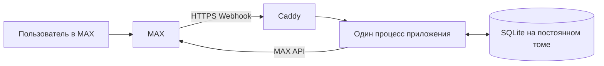

# G0: архитектура и комплект сдачи

> **2026-09-23 — SUPERSEDED для доменного плана «Игра состоится» (REJECTED_BY_USER).** Исторические состояния встреч/участия/очереди ниже не являются задачами реализации. Факты технической основы сохраняются в коде и неизменённой [квитанции G1](05_G1_TECHNICAL_RECEIPT.md). Повторное использование и новый объём: [pivot/03_IMPLEMENTATION_PLAN.md](pivot/03_IMPLEMENTATION_PLAN.md). Требования организатора к комплекту сдачи остаются действующими; новый продукт не утверждён.

Исследование: **2026-09-21**. Коррекция G0.1 и авторизация технического G1: **2026-09-22**. Правила продукта и доставки: **PROPOSED_PENDING_USER_APPROVAL**. Продукт [варианта A](01_PRODUCT_DECISION.md) — **RECOMMENDED — AWAITING USER APPROVAL**. Реализуется только технический probe G1; факты реализации и проверки — [квитанция 05](05_G1_TECHNICAL_RECEIPT.md). Историческое отсутствие кода на G0.1 сохранено в [квитанции 04](04_G0_1_REVIEW_RECEIPT.md). Требования: [00](00_REQUIREMENTS_AND_EVIDENCE.md); шесть этапов: [03](03_IMPLEMENTATION_PLAN.md).

## 02.1. Решение по стеку и окружению

**Предлагается:** TypeScript, Node.js 22 LTS с актуальным исправляющим выпуском выбранной ветки, Fastify 5, SQLite через better-sqlite3, Docker Compose, Caddy для публичного HTTPS.

React рассмотрен и исключён: выбранный путь состоит из коротких вопросов, кнопок и проверки статуса. Мини-приложение добавило бы клиентскую авторизацию, отдельный интерфейс и дополнительную поверхность проверки без необходимого выигрыша.

Python с веб-фреймворком — технически допустимая альтернатива. Сейчас нет подтверждения, что команда быстрее работает на Python; TypeScript соответствует рекомендации кейса и позволяет держать один серверный стек. PostgreSQL пока не нужен одному небольшому экземпляру приложения; переход потребуется при нескольких экземплярах или подтверждённой нагрузке, превышающей возможности текущего решения.

Совместимость Node.js 22 с Fastify 5 указана в официальной таблице. Просмотренный `package.json` better-sqlite3 требует Node ≥22. Это подтверждение направления выбора, а не проверенная сборка проекта. [T-01](https://nodejs.org/en/about/previous-releases), [T-02](https://fastify.dev/docs/latest/Reference/LTS/), [T-03](https://raw.githubusercontent.com/WiseLibs/better-sqlite3/master/package.json)

Точные версии TypeScript, зависимостей и digest образов фиксируются на G1 после проверки опубликованных релизов, лицензий и совместной Docker-сборки. Случайные номера версий в план не подставляются. После фиксации используются lockfile и воспроизводимая установка. MAX подключается небольшим адаптером к документированным HTTP-методам; совместимость с Telegram или VK не предполагается.

**Факт технического G1:** версии зафиксированы в package/lockfile и Dockerfile: Node 22.23.2, TypeScript 7.0.2, Fastify 5.12.5, better-sqlite3 13.0.3, lossless-json 4.3.1, zod 4.6.5; Caddy 2.11.4 подготовлен для public. Проверки и digest — в 05. Контейнер и SQLite probe реализованы; целевые доменные компоненты ниже остаются будущими G2–G4.

**Локально проверено без установки на этапе исследования 2026-09-21:**

| Компонент | Результат |
|---|---|
| Windows / PowerShell | Текущая среда |
| Node.js | `v22.20.0` |
| npm через `npm.cmd` | `10.9.3` |
| `npm.ps1` | Выполнение ограничено действующей политикой PowerShell; политика не менялась |
| Git | `2.50.1.windows.1` |
| Docker CLI | `29.7.2` |
| Docker Compose | `v5.5.1` |
| Docker daemon | Недоступен через ожидаемый named pipe из сессии исследования |
| Docker config | CLI сообщил об отказе в доступе; содержимое не читалось |
| Python | `3.12.10` |
| PyMuPDF и Pillow | Доступны; использованы для чтения PDF в памяти |
| Исходное содержимое проекта | До сохранения G0 обнаружен только PDF; приложение и репозиторий не создавались |
| Проверенные переменные секретов | Значения не выводились; выбранные имена отсутствовали в окружении процесса |

Проверялись имена `MAX_BOT_TOKEN`, `BOT_TOKEN`, `DATABASE_URL`, `PUBLIC_BASE_URL`, `WEBHOOK_SECRET`, `OPENAI_API_KEY`. Это не доказывает отсутствие токена у команды или в другом разрешённом хранилище. Перед реализацией состояние Docker и нужных переменных проверяется снова без чтения чужих секретов.

## 02.2. Возможности MAX для выбранного сценария

В столбце клиентов «проверить оба» означает обязательную будущую проверку в мобильном и веб-клиенте. Для всех строк документированность подтверждена указанным источником; пригодность на реальном хакатонном боте остаётся отдельно непроверенной.

| Функция | Механизм MAX | Источник | Ограничения | Mobile / web | Статус |
|---|---|---|---|---|---|
| Вход по приглашению | `https://max.ru/<bot>?start=<payload>`, `bot_started` | MAX-10 | Payload ≤128 символов; без персональных данных | Проверить оба, включая повторный переход | Документация CONFIRMED; smoke NOT_VERIFIED |
| Ввод условий организатором | `message_created`, ответ на вопрос бота через `Message.link` | MAX-12, MAX-19 | Личный диалог, текущий шаг черновика и роль; точный путь ID ответного сообщения сверить на G1 | Проверить оба | Документация CONFIRMED; smoke NOT_VERIFIED |
| Доступность связи | `bot_started`, `bot_stopped`, `dialog_removed`, `dialog_cleared`, `dialog_muted`, `dialog_unmuted` | MAX-12 | Отдельно от участия; нет предположения о глобальном порядке доставки | Проверить оба | Документация CONFIRMED; smoke NOT_VERIFIED |
| Участие, отказ, принятие места | Inline `callback`, событие `message_callback` | MAX-07 | Payload не является авторизацией | Проверить оба | Документация CONFIRMED; smoke NOT_VERIFIED |
| Ответ и актуальная карточка | `POST /answers`, `POST /messages` | MAX-08, MAX-09 | Для соответствующих методов до двух отправок в секунду в один диалог; текст сообщения до 4000 символов | Проверить оба | Документация CONFIRMED; smoke NOT_VERIFIED |
| Уведомление о предложении и результате | Сообщение пользователю, начавшему работу с ботом | MAX-08, MAX-17 | Нужны договорные права; доставка не означает прочтение | Проверить оба | Права TO_VALIDATE; smoke BLOCKED до подтверждения |
| Приём событий | Webhook и `X-Max-Bot-Api-Secret` | MAX-05 | Публичный HTTPS:443, доверенная цепочка TLS | Серверная часть; проверить события обоих клиентов | Документация CONFIRMED; smoke NOT_VERIFIED |
| Идентификация | Пользователь из проверенного события | MAX-11, MAX-12 | Имя/username не доказывают личность вне MAX | Одинаковое серверное правило | Документация CONFIRMED; smoke NOT_VERIFIED |
| Приглашение в существующий чат | Организатор вручную передаёт текст и диплинк | MAX-07, MAX-10 | Пересланные кнопки не сохраняются; текст должен содержать рабочую ссылку | Проверить оба | Документация CONFIRMED; smoke NOT_VERIFIED |
| Дополнительный удобный шаринг | `:share?text=...` | MAX-13 | Документирован для iOS, Android и web; desktop имеет отдельное ограничение | Could, после Must | Применимость TO_VALIDATE; smoke NOT_VERIFIED |

Бот не читает историю группы, не получает список всех её участников и не добавляет людей в чат. Сценарий сообщества реализуется через личные диалоги с ботом и приглашение организатора. Поэтому права администратора группового чата не входят в минимальные предпосылки. Изменения групповых методов из MAX-03 не затрагивают обязательный сценарий.

**Актуальная интеграция на дату исследования:**

- Базовый адрес: `https://platform-api2.max.ru`.
- Авторизация: заголовок `Authorization: <access_token>`, без токена в query.
- Production: Webhook. Long Polling разрешён документацией для разработки и тестирования, несовместим с активным webhook и не выбран для MVP.
- Документация указывает общий ориентир до 30 запросов/с; приложение вводит более низкий собственный предел.
- Проверка на выданном боте обязательна: техническое описание методов не подтверждает договорные полномочия. [MAX-02](https://dev.max.ru/docs-api), [MAX-04](https://dev.max.ru/docs-api/use-cases/event-notifications), [MAX-06](https://dev.max.ru/docs-api/methods/GET/updates)

Webhook должен отвечать HTTP 200 в пределах 30 секунд. Документированы повторные доставки и автоматическая отписка после длительной неуспешной доставки; для эксплуатации критичен контроль подписки. Приложение стремится сохранить входное событие и ответить за 2 секунды, выполняя дальнейшую работу после сохранения. Публичный endpoint требует сертификата доверенного CA, полного соответствия имени и цепочки; самоподписанный сертификат не подходит. [MAX-05](https://dev.max.ru/docs-api/methods/POST/subscriptions)

**HTTPS и сертификаты:** действующая документация требует учитывать сертификат Минцифры при исходящих запросах к новому API. На G1 проверяется цепочка с включённой TLS-валидацией. Если нужен дополнительный CA, он получается из подтверждённого официального источника и подключается только внутри контейнера/процесса. Изменение системного хранилища Windows и отключение TLS запрещены. [MAX-03](https://dev.max.ru/docs-api/changelog-api)

Географические ограничения конкретного хостинга не считаются установленными по отсутствию упоминания в просмотренных страницах. Пригодность выбранного адреса проверяется настоящей входящей и исходящей доставкой на G1.

**Мини-приложение: NOT_APPLICABLE.** Если решение изменится, потребуется доступ к настройкам бота для установки HTTPS URL. Сам токен такого доступа не доказывает. Сервер должен проверять исходную строку `initData` по актуальному алгоритму MAX, включая уникальность параметров, подпись и допустимый возраст; `initDataUnsafe` и клиентский `user_id` не подходят для авторизации. Некоторые методы Bridge, включая SecureStorage, не работают в web. Добавление мини-приложения потребует пересмотра плана, а не скрытого расширения MVP. [MAX-13](https://dev.max.ru/docs/webapps/introduction), [MAX-14](https://dev.max.ru/docs/webapps/bridge), [MAX-15](https://dev.max.ru/docs/webapps/validation)

## 02.3. Компоненты и движение данных

Один процесс приложения содержит:

- проверку входных запросов и адаптер MAX;
- диалог создания встречи;
- бизнес-правила набора и очередь;
- обработчик сохранённых событий;
- обработчик сроков и исходящих уведомлений;
- минимальные health-проверки.

Отдельные микросервисы, Redis, брокер сообщений, векторная база и AI-сервис не нужны. Таблицы входных событий и исходящих действий находятся в той же SQLite.

**Движение действия:**

1. MAX доставляет событие.
2. Сервер проверяет секрет, тип, размер и структуру.
3. Событие сохраняется с ключом защиты от повторов; после успешной записи возвращается HTTP 200.
4. Обработчик извлекает пользователя из проверенного события; в транзакции сначала актуализирует сроки, затем проверяет роль, команду и её свежесть по 02.5.2.
5. Та же транзакция фиксирует участие/предложение/встречу, результат команды и необходимое исходящее действие.
6. Отдельная итерация того же процесса отправляет ответ через MAX API.
7. «Мой статус» всегда формируется из текущего состояния базы.

Старое сообщение в чате — представление, а не источник истины.

## 02.4. Сущности, состояния и права

Политика продукта — 01.4; все изменения G0.1 **PROPOSED_PENDING_USER_APPROVAL**. Ниже её единая техническая модель, а не ещё один настраиваемый вариант.

| Сущность | Минимальное содержание |
|---|---|
| User | MAX ID строкой, необходимое имя, версия принятых условий; без вывода о явке |
| ContactState | Доступность исходящей связи, mute, водяные отметки timestamp по независимым видам событий; не статус участия |
| Event | Владелец, неизменные опубликованные условия, D/S/E, фактическое C, статус, ревизия управления, замороженная при C очередь, `is_demo` |
| Enrollment | Пара (встреча, пользователь), `attempt_id`, персональная `revision`, состояние, устойчивый `queue_seq`, причина и неповторяемый `pause_id` текущей паузы |
| Offer | Неповторяемый ID, попытка участия, резерв, сроки, факт подтверждённого приёма MAX, терминальный исход |
| Command | Непредсказуемый ID, актор, действие, целевая встреча/попытка/предложение/черновик, ожидаемая ревизия, срок, сохранённый результат |
| InboundEvent / OutboundAction | Дедупликация доставки; отдельное состояние обработки/отправки, попытки, зависимости и актуальность |
| Conversation | Один черновик владельца, его ревизия, вопрос/шаг и ID сообщения-вопроса; выбор встречи не меняет другие записи |
| DeliveryControl / AuditTransition | Одна запись паузы доставки предложений; временные отметки и причины переходов без секретов/свободных текстов |

MAX ID хранится десятичной строкой без предварительного округления `int64`. Локальная проверка разбора в Node.js 22.20.0 была выполнена на G0; окончательный runtime проверяется T10, а не объявляется испытанным приложением.

### 02.4.1. Встреча и участие

`DRAFT → OPEN → READY`; `READY ↔ RECOVERING`; `READY → IN_PROGRESS → FINISHED`.

При недостатке подтверждений в C или S — CANCELLED. Явная отмена опубликованной встречи владельцем разрешена в OPEN/READY/RECOVERING только до S. RECOVERING должен вернуться в READY до S; иначе в S — CANCELLED. Неполный DRAFT можно явно удалить без объявления отменённой встречи и без проверки ещё не заданного S. Достижение S/E говорит о расписании, не о фактическом проведении.

- В OPEN новая запись сразу даёт CONFIRMED, если есть место и нет более раннего доступного WAITING; иначе WAITING с новым `queue_seq`.
- WAITING → OFFERED резервирует место; явное принятие действующего предложения даёт CONFIRMED.
- Явный отказ от участия либо «Отказаться от места и выйти из очереди» даёт WITHDRAWN и прекращает текущую позицию. До C повторная запись создаёт новый `attempt_id` и позицию в конце; после C новые попытки запрещены.
- WAITING_PAUSED сохраняет прежний `queue_seq`, но временно исключён из выбора. Явное «Возобновить предложения» возвращает WAITING до S, только если эта попытка входит в допустимую очередь. Это не новая запись и не восстановление WITHDRAWN.
- При C в очередь для замен входят уже существующие WAITING, WAITING_PAUSED и OFFERED. Подтверждения считаются без резервов. Если минимум достигнут, действующие предложения сохраняются до их срока; новые люди не добавляются.
- При S непринятые предложения закрываются; ожидающие получают CLOSED с причиной `START_NO_SEAT`. Подтверждения сохраняются как неизменный регистрационный состав. Если встреча отменена, все её нетерминальные участия получают CLOSED с причиной `EVENT_CANCELLED`; прежнее состояние остаётся только в ограниченном журнале.

Инварианты: CONFIRMED плюс активные резервы ≤ вместимости; одна текущая попытка на пару пользователь/встреча; одно принятие предложения; место не выдается после его срока или S. Никакое событие доступности связи не снимает CONFIRMED.

### 02.4.2. Навигация, черновик и права

«Мои встречи» показывает собственные встречи и свои участия, включая приостановленную очередь; карточка содержит ID/название, дату, роль и актуальный статус. Варианты «Мой статус», «Мои встречи», «Продолжить черновик» не меняют участие. Список участников доступен только владельцу; обычный участник видит лишь себя и агрегаты.

На владельца — один незавершённый черновик. Ответ на вопрос формы привязывается к текущему сообщению-вопросу и ревизии шага; произвольный текст без нужного контекста не применяется к другой встрече. Документированный `Message.link` содержит контекст ответа; конкретную структуру и удобство «Ответить» проверить на G1 в обоих клиентах [MAX-19](https://dev.max.ru/docs-api/objects/Message). При выходе в меню черновик сохраняется, ожидаемый ввод приостанавливается; возобновление показывает актуальный вопрос. Старая ссылка на удалённый/истёкший черновик его не создаёт заново. Перед публикацией всегда видна итоговая карточка и отдельное подтверждение владельца.

Организаторы допускаются оператором по ограниченному списку ID. Владелец действует только со своими встречами и не записывает людей за них; собственное место занимает явным действием. Приглашение даёт доступ к карточке, не к управлению. Оно непредсказуемо и не содержит персональных данных. Роль и личность берутся из проверенного события MAX, а не из текста кнопки, имени или клиентского `user_id`.

## 02.5. Связь, команды, время и доставка

### 02.5.1. Жизненный цикл связи (F02)

Текущая документация описывает шесть нужных событий и `timestamp` как время события в миллисекундах. Она не устанавливает используемой нами гарантии глобального порядка. Семантика событий — CONFIRMED; правила разрешения конфликтов ниже — **PROPOSED_PENDING_USER_APPROVAL**. [MAX-12](https://dev.max.ru/docs-api/objects/Update)

| Событие MAX | Документированный смысл | Предлагаемая реакция приложения |
|---|---|---|
| `bot_started` | Начало либо возобновление общения | Более новое событие разрешает связь; не меняет участия и не возобновляет очередь само |
| `bot_stopped` | Остановка/удаление бота | Прекратить новые исходящие сообщения; CONFIRMED не менять |
| `dialog_removed` | Удаление диалога, сопровождается `bot_stopped` | Та же остановка связи, без двойного бизнес-действия |
| `dialog_cleared` | Очистка истории | Не менять участие, доступность связи или очередь; восстановить карточку по новому запросу |
| `dialog_muted` | Отключение уведомлений | Отдельный mute-флаг; сообщения допустимы, для `POST /messages` использовать `notify:false` |
| `dialog_unmuted` | Включение уведомлений | Снять mute; не воспроизводить старые уведомления |

На пару бот/пользователь хранятся независимые водяные отметки для stop/start, mute/unmute и clear. Идентификатор субъекта извлекается только из документированных полей данного типа; если сопоставление отсутствует или timestamp невалиден, событие сохраняется как требующее разбора, а участие не меняется. Точные поля всех типов сверить на G1; отсутствие глобального `update_id` не восполняется догадкой.

- Timestamp меньше сохранённого для той же группы — устаревшее наблюдение, его эффект не применяется. Время HTTP-приёма не заменяет timestamp.
- При большем timestamp применяется новое наблюдение. При равном сохраняется набор типов: stop + removed означают одну остановку; start + stop/removed дают UNKNOWN с запретом исходящих до строго более нового явного возобновления. Mute + unmute в один момент разрешаются консервативно как muted.
- Итоговое состояние связи одинаково при перестановке событий с равным timestamp. Уже завершённое участие или освобождённый резерв не восстанавливаются при уточнении наблюдения. Не утверждается, что мы восстановили реальный порядок действий пользователя: при конфликте выбирается безопасная неопределённость.
- Возобновление требует более нового `bot_started` в клиенте. UNKNOWN/STOPPED не устраняется администратором от имени пользователя. Записи WITHDRAWN/CLOSED не восстанавливаются; WAITING_PAUSED требует отдельного действия «Возобновить предложения».

При актуальной остановке связи обычный WAITING тоже становится WAITING_PAUSED / UNREACHABLE с прежним `queue_seq`; UNKNOWN даёт паузу CONTACT_UNCERTAIN. Для новой причины паузы или нового актуального stop создаётся новый `pause_id`, в том числе если очередь уже приостановлена. Поэтому прежнее разрешение возобновить предложения не снимает более позднюю паузу. CONFIRMED, WITHDRAWN и CLOSED этим не меняются.

При актуальной остановке связи неподтверждённое предложение закрывается как `RECIPIENT_UNREACHABLE`, резерв освобождается, попытка остаётся WAITING_PAUSED с прежним порядком. Равный конфликт start/stop закрывает такой резерв с отдельной причиной `CONTACT_UNCERTAIN` и тем же сохранением позиции; это не утверждение о доказанной недоступности. Если предложение уже принято транзакцией, CONFIRMED сохраняется. Более старый stop, пришедший после нового start, не закрывает новое предложение.

**Владелец остановил бота, но сам не записан:** изменяется только ContactState. Пользователи по действующему приглашению видят условия, свой статус и нейтральный признак «Связь с организатором через бот недоступна»; чужие данные не раскрываются. D/S/E и очередь продолжают работать. Оператор видит техническую проблему, может восстановить инфраструктуру, возобновить сервисную доставку по 02.5.3 и принять обращение через опубликованный канал поддержки. Он не подтверждает участие, не передаёт владение, не снижает минимум и не отменяет встречу без явного аутентифицированного решения владельца.

### 02.5.2. Идентичность команды и авторитет времени (F04)

Дедупликация входной доставки и свежесть бизнес-команды — две разные проверки. Message ID/тип и callback ID защищают только от повторной доставки; новый callback со старой кнопки обязан пройти проверки её команды.

Кнопка содержит непредсказуемый `command_id`, разрешаемый сервером в актор, встречу, действие, цель и срок. Собственный срок команды — максимум 30 минут от выдачи, дополнительно ограниченный дедлайном действия (D для новой записи/публикации, S для отказа/замены, фиксированным response_deadline предложения для accept/decline; более короткий действующий резерв дополнительно проверяется). Это предложение команды, не TTL callback MAX. Обновление карточки выдаёт новую команду с текущей ревизией; истёкшая кнопка предлагает получить такую карточку. Дополнительно:

- join/rejoin: ожидаемая персональная ревизия пары пользователь/встреча и допустимое исходное состояние; rejoin создаёт новый `attempt_id` и увеличивает ревизию;
- withdraw/resume: текущий `attempt_id` и персональная ревизия намерения; техническая пауза доставки сама по себе не создаёт новое намерение. Для resume дополнительно нужен текущий `pause_id` и разрешённая связь; устаревшая команда прежней паузы не возобновляет новую. Withdraw не зависит от `pause_id` и остаётся явным отказом от текущей попытки;
- accept/decline: точный `offer_id`, попытка и актор, активный резерв и его срок; новое предложение всегда имеет новый ID;
- publish: ID/ревизия черновика и уникальная операция публикации;
- early-close/cancel: владелец, ревизия управления событием и допустимая фаза; требуется отдельная актуальная кнопка подтверждения.

Ревизии участия других людей не делают кнопку пользователя устаревшей. Ревизия управления меняется от публикации/закрытия/отмены владельцем, а не от каждого изменения численности. Текущее состояние и дедлайны проверяются всегда. Повтор уже завершённой команды возвращает её исход и актуальную карточку без повторного перехода; неизвестная или удалённая команда отклоняется, не воссоздаётся из payload.

Примеры: join → withdraw → rejoin создаёт новую попытку, поэтому старая withdrawal-команда бессильна. Старый join после нового withdraw не совпадает с персональной ревизией. Истёкший offer O1 не принимает место нового O2. Две публикации одного черновика не создают две встречи/два приглашения; повтор early-close не закрывает окно замен и не меняет уже принятое решение.

**Авторитет бизнес-времени:** серверное UTC в момент сериализованного решения `t`, сразу после получения write-lock SQLite, а не MAX timestamp и не `received_at`. Это точка упорядочения транзакции; последующее завершение commit может быть чуть позже. Внутри транзакции нет сетевых вызовов/ожиданий. Timestamp MAX используется только для обработки наблюдений связи, не для продления резерва.

Порядок каждой транзакции:

1. Получить write-lock, определить `t`; не допускать отката логического времени ниже последнего сохранённого. При неисправных часах — техническая остановка изменений и диагностика оператору.
2. Если встреча терминальна, не оживлять её. Иначе применить наступившие C (автоматическое D), затем S, затем E в хронологическом порядке; закрыть недействующие предложения. Для ещё допускающей замену встречи применить сроки резервов и актуальные ограничения связи/сервиса.
3. Проверить актора, command ID, попытку, ревизии, состояние, вместимость и точную границу времени. Для нового join нужно OPEN и `t < D`; после досрочного C OPEN уже нет. Для принятия нужны действующий резерв и `t < offer_deadline` и `t < S`. Равенство сроку — отказ, а не дополнительная секунда.
4. Зафиксировать бизнес-переход, использованную команду, результат, нужные уведомления и обработку inbox одним commit. Выдача/освобождение резервов входит в ту же транзакцию.

Если webhook принят и сохранён до срока, но обработан после него, команда отклоняется по текущему `t`; в README это объясняется как отсутствие гарантии приёма заявки у самой границы. Не предоставляется задним числом место, уже освобождённое другим переходом. При гонке отмены и принятия до S выигрывает первая сериализованная транзакция: отмена первой запрещает принятие; принятие первым не запрещает последующую явную отмену всей встречи. При `t = S` сначала выполняется переход расписания, поэтому новая отмена/принятие уже недопустимы.

**Перезапуск:** сначала согласовать сохранённые D/S/E, предложения и очередь с текущим временем, затем обрабатывать оставшийся inbox и outbox. Нельзя проигрывать старые действия на историческом времени их получения. Рабочий цикл сроков — каждые 10 секунд; синхронная проверка на каждом действии сохраняет точную границу. Если сервер был выключен до E, восстанавливаются логические исходы расписания без заявления о проведении встречи и без рассылки промежуточных устаревших карточек.

### 02.5.3. Очередь при сбоях доставки (F03)

Один обработчик и таблицы SQLite; брокер или отдельный сервис не добавляются. Выбирается консервативная пауза выдачи предложений при неопределённости платформы. `queue_seq` сохраняется при технических причинах; продвижение мимо человека не равняется его отказу.

**Ограничения, предложенные командой:** запрос ≤10 секунд, максимум 3 попытки одной отправки. При создании фиксируются `notify_deadline = min(created_at + 60 секунд, S)` и `response_deadline = min(created_at + 10 минут, S)`; для явно маркированного демо второй интервал — 1 минута. Действующий `offer_deadline` равен notify_deadline в NOTIFYING, а после валидного подтверждения `POST /messages` до этой границы — response_deadline в ACKNOWLEDGED. Срок команды кнопки ограничен response_deadline, но сама команда не обходит более короткий резерв. Успех API не начинает срок заново. Явное принятие пользователем допустимо и при неопределённом результате отправки, пока сам резерв действителен. Все переходы проверяют время по 02.5.2.

| Терминальный исход предложения | Участие и позиция | Резерв и дальнейшее действие |
|---|---|---|
| ACCEPTED | CONFIRMED; позиция становится историей | Резерв превращается в занятое место атомарно |
| DECLINED: явное «Отказаться от места и выйти из очереди» | WITHDRAWN, позиция прекращается | Освободить место; выбрать следующего доступного ожидающего |
| EXPIRED_NO_RESPONSE: подтверждённая API отправка, нет ответа в срок, не было известного сбоя | WAITING_PAUSED / NO_RESPONSE, прежний `queue_seq`, новый `pause_id` | Освободить; следующий доступный; возврат только явным «Возобновить предложения» до S |
| DEFERRED_SERVICE: временная/общая ошибка или срок предложения истёк во время известной сервисной паузы | WAITING, прежний `queue_seq` | Освободить; новые предложения всем приостановлены, очередь не расходуется |
| RECIPIENT_UNREACHABLE: достоверный актуальный stop/removed | WAITING_PAUSED / UNREACHABLE, прежний `queue_seq` | Освободить; можно выбрать другого доступного ожидающего; start сам очередь не возобновляет |
| CONTACT_UNCERTAIN: равные конфликтные start/stop | WAITING_PAUSED / CONTACT_UNCERTAIN, прежний `queue_seq` | Освободить; не считать доказанным отказом или недоступностью; более новый start и явное возобновление обязательны |
| DEFERRED_AMBIGUOUS: сообщение могло быть принято, но подтверждения нет к концу 60-секундного бюджета | WAITING, прежний `queue_seq` | Освободить; общая пауза выдачи сохраняется до проверки восстановления |
| EVENT_CANCELLED / FINAL_CUTOFF | CLOSED с причиной; очередь больше не активна | Освободить все резервы; новые предложения запрещены |
| Поздний успех MAX после любого терминального исхода | Не меняет участие или позицию | Только диагностическая запись LATE_RESULT; старый ID навсегда недействителен |

**Классификация ошибок.** Timeout, разрыв соединения, 429, 5xx и непонятный/повреждённый ответ рассматриваются как возможная общая проблема, а не отказ конкретного человека. Ошибка авторизации останавливает исходящую отправку до проверки оператором. Получатель признаётся недоступным по актуальному lifecycle-событию; API-код можно добавить только после подтверждения его конкретной семантики официальным источником на G1. Сейчас недокументированные коды/сроки не закладываются; HTTP 401 не означает отказ участника.

При первой общей/неопределённой ошибке устанавливается сохраняемый флаг PAUSED для **новых предложений**. Уже существующие резервы не продлеваются: максимум 60 секунд для неподтверждённой отправки, максимум установленного offer_deadline для ACKNOWLEDGED. После исчерпания трёх попыток или 60 секунд (что раньше) неподтверждённый резерв закрывается с соответствующей технической причиной. Действительное принятие остаётся возможным до закрытия; известный сбой помечает незавершённые предложения, чтобы их истечение вернуло WAITING, а не объявило NO_RESPONSE. Явный отказ пользователя имеет собственный исход DECLINED независимо от этой пометки.

Во время PAUSED новые кандидаты не резервируются и не уведомляются по кругу. Обычные запросы статуса могут обрабатываться, но их исходящие ответы также имеют ограниченные попытки и не обходят STOPPED/UNKNOWN контакта. Пользователь видит состояние базы, когда доставка вновь доступна. При явной записи во время сбоя он не обходит более ранних WAITING; наличие свободного физического места не отменяет очередь.

**Восстановление:** оператор сервиса по документированной процедуре выполняет одну контрольную отправку согласившемуся тестовому получателю и проверяет новый callback через webhook. Не чаще одного такого запуска в 60 секунд; без автоматического бесконечного опроса и без отправок очереди ради проверки. Только после подтверждённого восстановления снимается PAUSED. Обработчик сначала согласует сроки, затем выдаёт новые ID предложений по сохранённому FIFO доступных WAITING. WAITING_PAUSED автоматически не активируется. Явное возобновление прежнего порядка не отнимает уже подтверждённое место или действующий резерв другого человека; при отсутствии свободного места пользователь ждёт следующую вакансию. Если S уже прошёл, очередь закрывается, даже если сервис восстановлен. Роль дежурного для этой процедуры — предпосылка эксплуатации G4/G5.

Пример общего сбоя на 90 секунд: первый резерв освобождён не позже 60 секунд, его участник остаётся первым WAITING; второй человек не получает ложного «ваша очередь прошла». После восстановления до S первым снова рассматривается тот же участник, с новым offer ID. Поздний ответ или кнопка от старого предложения не принимаются даже при свободном месте.

**Дополнение G1 к 02.5.3: восстановление доставки — PROPOSED_PENDING_USER_APPROVAL, реализация только G3.** Текущая ручная политика требует дежурного даже после краткого общего сбоя. Её преимущество — человек проверяет бот, исходящую отправку и обратный callback; недостаток — задержка восстановления зависит от присутствия оператора, а не только от MAX.

Рекомендуется один ограниченный автоматический вариант для временных transport/5xx/429 с сохранением ручной ветки для 401/403, конфигурации, TLS и необъяснённых semantic failures. Пока сервис PAUSED, выполнить максимум три контрольные попытки через 15/30/60 секунд от предыдущего отказа, не позже 120 секунд от начала восстановления. Каждая попытка: проверка идентичности `GET /me`, затем не более одного маркированного контрольного сообщения заранее согласившемуся тестовому получателю. Успех означает только валидный Message с ожидаемым recipient; это не свидетельство чтения или исправности входящего webhook. Не использовать ожидающих участников как контрольных получателей. При 429 соблюдать Retry-After; если он выходит за бюджет, оставить PAUSED. При неоднозначной контрольной отправке не повторять её автоматически: передать оператору. После исчерпания бюджета — PAUSED до оператора, без бесконечного перезапуска цикла.

После подтверждённого исходящего успеха сначала согласовать сроки; только затем разрешить новые обычные отправки. Просроченные offers/commands/outbox не оживают; для сохранившего порядок WAITING нужен новый offer ID. Восстановление само не расходует очередь, не активирует WAITING_PAUSED и не снимает CONFIRMED. Повторный общий сбой до первого успешного обычного действия возвращает PAUSED и требует оператора, не запускает новый цикл. При отсутствии согласованного контрольного получателя остаётся ручной порядок. Проверка реального обратного webhook остаётся обязательной отдельной эксплуатационной проверкой.

Основание: контрактная разница ошибок подтверждена API MAX; G1 проверяет bounded retries, semantic failure, recipient и неопределённый timeout локально. Это не доказательство действенности автоматического восстановления очереди: она ещё не реализована, нагрузка/90-секундный сбой/обратный путь должны проверяться в G3 по T07/T17/T18/T24. Риск автоматического снятия транспортной паузы при неисправном входящем пути сохраняется явно. Политика не утверждена и не подменяет действующее предложение G0.1 до решения пользователя.

### 02.5.4. Контракты успеха и независимые результаты (F05)

| Уровень | Что именно подтверждает | Чего не подтверждает |
|---|---|---|
| Наш HTTP 200 webhook | Событие надёжно принято либо распознано как повтор | Запись человека, успешную отправку MAX или прочтение |
| Commit бизнес-транзакции | Конкретный переход состояния и его результат | Доставку уведомления |
| Валидный успешный ответ MAX по конкретному методу | MAX принял соответствующую исходящую операцию | Прочтение человеком или реальную явку |
| Пользовательское действие | Согласие с конкретной актуальной командой | Само по себе не телеметрия чтения всех сообщений и не факт посещения |

**Валидация по методу:**

- `POST /answers`: HTTP 200 и корректный JSON с boolean `success:true`. `success:false`, отсутствие поля или неверный тип — не успех; строковое сообщение об ошибке не интерпретируется как документированный код. [MAX-09](https://dev.max.ru/docs-api/methods/POST/answers)
- `POST /messages`: HTTP 200 и валидный объект `message` по схеме Message, включая идентификатор созданного сообщения и ожидаемого получателя. Нельзя требовать выдуманное общее `success` у этого метода. Точные поля вложенных объектов сверяются на G1 и фиксируются контрактом. [MAX-08](https://dev.max.ru/docs-api/methods/POST/messages), [MAX-19](https://dev.max.ru/docs-api/objects/Message)
- `POST /subscriptions` при будущем разрешённом подключении: HTTP 200 и `success:true`; затем отдельная реальная проверка входящего события. В G0.1 метод не вызывается. [MAX-05](https://dev.max.ru/docs-api/methods/POST/subscriptions)

Семантическая ошибка сохраняется как FAILED_SEMANTIC, повреждённый ответ/неоднозначный timeout — как UNKNOWN_RESULT; они не помечают outbox успешным и не откатывают уже совершённое участие. Для неуспешного callback-ответа допустима одна обычная актуальная карточка состояния, если разрешены связь/сообщения; она не повторяет бизнес-команду. Без подтверждённой классификации семантической ошибки автоматические повторы прекращаются. При 401 отправка остановлена до оператора, при 429 применяется документированная задержка, если она присутствует; общий бюджет по 02.5.3 сохраняется. Обещание «ровно одно сообщение» не даётся.

Callback TTL платформы и недокументированные error codes — UNKNOWN. Сроки наших Command/Offer — собственная политика, не значения MAX. До фактического чтения статусы «доставлено человеку»/«прочитано» не используются; такой измеряемой возможности MVP не заявляет.

## 02.6. Безопасность и диагностика

Решения приложения:

- Секрет webhook обязателен; сравнение безопасное, отсутствие или несовпадение отклоняется.
- Параметризованные SQL-запросы, ограничение размеров и длин полей, обычный текст вместо исполнения пользовательской разметки.
- Callback проверяется по реальному отправителю и актуальному состоянию.
- Не запрашиваются телефон, геолокация, контакты, медицинские сведения и история группы.
- В логах нет токенов, заголовков авторизации, полных тел событий, имён и текстов пользовательских сообщений.
- Логи содержат технический correlation ID, тип операции, обезличенный идентификатор встречи, длительность, код результата и число повторов.
- Доступ к базе и резервным копиям ограничен оператором.
- Контейнер приложения работает без root; секреты не входят в слои образа.
- Нужны доступные сведения об операторе, условиях использования, обработке данных и способе обращения.

Правила MAX отдельно требуют оснований обработки данных и ограничивают сервисные сообщения договором. На G1 проверяется применимость уже выданных условий организаторского доступа; новое разъяснение нужно только при отсутствии или противоречии оснований. Согласие пользователя не объявляется самостоятельной заменой договорных прав. Это проверка применимых условий, а не заключение о юридической готовности ещё не созданного продукта. [MAX-16](https://dev.max.ru/docs/legal/rules), [MAX-17](https://dev.max.ru/docs/legal/requirements)

### 02.6.1. Сохранение, сроки и удаление

Все сроки ниже — **PROPOSED_PENDING_USER_APPROVAL / ASSUMPTION**, не утверждение о нормативных сроках. На G1 назначается оператор и проверяются применимые основания; G4 проверяет исполнение политики.

| Данные | Предлагаемый предел | Удаление / восстановление |
|---|---|---|
| User и ContactState | Пока есть активная встреча/попытка/черновик; иначе 30 дней после последнего явного действия в продукте | Удалить профиль и имя; lifecycle-событие само не создаёт заново удалённый профиль/участие |
| Заброшенный черновик | 7 дней после последнего редактирования | Удалить поля и ожидаемый ввод; старая команда отвергается |
| FINISHED и связанные участия/предложения/команды | 30 дней после E | Удалить привязанные персональные данные; оставить только необратимые агрегаты при наличии оснований |
| CANCELLED и связи | 30 дней после отмены | Тот же порядок; не ждать никогда не наступившего FINISHED |
| Обработанный inbox | Минимальная полезная нагрузка ≤24 часов после обработки; ключ/статус дедупликации ≤7 дней | Не хранить полный сырой MAX-архив; неизвестная старая команда не исполняется после удаления ключа |
| Необработанный/ошибочный inbox | Разбор оператором при возрасте 24 часа; полезная нагрузка не более 7 дней | Применить актуальные сроки/отклонить просроченное, записать технический исход и удалить; бесконечного накопления нет |
| Терминальный outbox | Текст/получатель ≤24 часов; технический исход ≤7 дней | Очистка не меняет уже совершённый бизнес-результат |
| Неотправленный outbox | До срока актуальности действия, максимум 7 дней | Предложения ограничены 60 сек/offer_deadline/S, старые итоги заменяются текущим статусом; после срока закрыть как устаревшее |
| Диагностические логи | 7 дней | Без имён, тел сообщений, ID MAX и секретов |
| Резервные копии | Скользящие 7 дней | Закрытый доступ; срок удаления из копий объяснён пользователю |
| Реестр подтверждённых удалений | 37 дней | Только внутренний случайный ID и время; отдельная защищённая копия для применения перед восстановлением отправки |

User с действующим отказом WITHDRAWN не восстанавливается от start. Если профиль уже удалён, требуется новое явное принятие условий и актуальная продуктовая команда, а не replay старого события. Очистка истории MAX не является запросом удалить данные приложения; это объясняется в условиях и в поддержке.

**Запрос удаления данных:** опубликованный канал оператора, проверка принадлежности запроса через действующий аутентифицированный канал и явное подтверждение последствий. Для участника до S запрос включает отдельное подтверждение снятия его активных записей; для владельца — явную отмену собственных ещё не начавшихся встреч перед удалением привязки. Оператор записывает основание/актёра запроса и выполняет удаление, не имитируя callback пользователя. После S профиль можно обезличить без изменения исторического числа регистраций или заявления о явке. Срок исполнения и допустимость сохранения минимальных оснований утверждаются в политике; отсутствие связи само по себе не заменяет запрос.

**Перезапуск и backup:** база, черновики, inbox/outbox, дедлайны, команды, флаги паузы и lifecycle-отметки сохраняются на томе. В памяти теряются только временные соединения. Повторный запуск не заполняет базу демоданными поверх существующих записей. Согласованная ежедневная копия средствами SQLite; до сдачи одна проверка восстановления [T-06](https://www.sqlite.org/backup.html). Перед приёмом пользовательских команд/рассылкой после восстановления применяются реестр удалений, очистка по срокам и согласование C/S/E. Простое копирование работающего файла без учёта состояния базы не считается проверенным backup.

При недоступной SQLite webhook не подтверждает сохранение: HTTP 503 вместо ложного 200. Восстановление и результаты семантических ошибок не отменяют требования атомарной вместимости. Диагностика отслеживает возраст inbox, сроки резервов, PAUSED, отказы MAX и состояние webhook; публичный health не раскрывает данные. Афиша, внешняя бронь и AI — NOT_APPLICABLE.

**Восстановление старого snapshot — PROPOSED_PENDING_USER_APPROVAL, реализация G4.** Обязательная последовательность: согласованный backup B → пользователь A принимает место, B отказывается после backup → рабочая SQLite утрачена → restore backup B. Даже корректная копия не содержит двух последних действий. Ни согласование C/S/E, ни реестр удалений не восстанавливают отсутствующие изменения участия. Это потеря подтверждённых приложением данных, а не обычный restart с сохранённым томом.

Предлагаемые границы: RPO ≤15 минут (согласованные копии каждые 15 минут вместо исходного ежедневного предложения), RTO ≤60 минут при доступном операторе и исправном хранилище. Это целевые допущения, не измеренные гарантии G1. Если возраст пригодной копии больше RPO либо сверка не укладывается в RTO, нормальная работа остаётся заблокированной; пользователь/оператор отдельно принимает последствия и решение о продолжении.

До обычных команд и отправок включить режим восстановления: применить сохранившийся вне потерянной SQLite реестр удалений и сроки хранения; объявить восстановленные активные встречи требующими сверки, а их состав — непроверенным. Старые command IDs аннулировать, неподтверждённые исходящие действия закрыть как неопределённые/устаревшие и не воспроизводить автоматически. Подтверждение отправки, потерянное после backup, нельзя восстановить догадкой. Терминальные и истёкшие встречи не оживлять.

Для активных встреч нужна явная сверка с владельцами и затронутыми участниками; прежний snapshot не доказывает актуальное согласие. При невозможности сверки — сохранить блокировку и предложить владельцу явную отмену/новую встречу, без действий оператора от его имени. Только после зафиксированной сверки и актуализации сроков разрешить новые команды с новыми ID и заново рассчитанные актуальные уведомления. Автоматический журнал репликации/восстановления утраченных намерений здесь не предлагается. Проверки T11/T22 должны показать разницу между сохранённым snapshot и более поздними потерянными действиями.

## 02.7. Локальный и публичный запуск

**Локально:** один контейнер приложения с SQLite на томе; Compose запускает необходимые компоненты одной командой. Локальный HTTP доступен только на loopback. Этот запуск позволяет проверить обработчики, состояния и фикстуры. Планируемая команда R10: `docker compose up --build -d`; на G0 она не выполняется и конфигурация не создаётся.

Для настоящего MAX необходим доступный платформе HTTPS endpoint. По умолчанию реальные проверки проводятся на согласованном публичном сервере. Локальные HTTP-тесты не считаются smoke в MAX. Туннель, второй токен и изменение действующей подписки не предполагаются автоматически. Long Polling не избавляет публичную версию от webhook и потребовал бы отдельной реализации; поэтому второй транспорт в MVP не заложен.

**Публично:** тот же образ приложения, постоянный том SQLite и Caddy. Предлагаемый стартовый размер — **1 vCPU, 2 ГБ RAM, 20 ГБ диска**, один постоянно работающий экземпляр. Это оценка для малого пилота, которую проверяют на G1/G4.

Нужны:

- согласованный сервер и оператор;
- домен или поддомен, направленный на сервер;
- входящие 443 и, для выбранного способа выдачи сертификата Caddy, 80;
- исходящий HTTPS к MAX;
- хранение состояния и сертификатов;
- секреты через закрытое окружение;
- доступность до окончания периода проверки.

Автоматическое HTTPS Caddy требует корректного DNS, доступных портов и постоянного хранилища. Фактическую пригодность сети необходимо проверить. [T-04](https://caddyserver.com/docs/automatic-https)

Имена планируемых переменных:

`MAX_BOT_TOKEN`, `MAX_WEBHOOK_SECRET`, `MAX_API_BASE_URL`, `PUBLIC_BASE_URL`, `DATABASE_PATH`, `ORGANIZER_MAX_IDS`, `APP_MODE`, `DEFAULT_TIMEZONE`, при необходимости `NODE_EXTRA_CA_CERTS`.

Значения в документации — только placeholders.

Оценочный бюджетный конверт инфраструктуры — **1–3 тыс. руб./месяц плюс домен при необходимости**. Это **ASSUMPTION, не подтверждённый тариф**. Поставщик, счёт, бюджет и наличие существующего сервера — UNKNOWN. До заказа получить предложение и утвердить расходы. Сейчас ничего не приобретается и не разворачивается.

Остановка и повторный запуск сохраняют том. Команды удаления томов не включаются в обычный порядок перезапуска. Публичная версия запускается тем же Compose-процессом с документированными настройками HTTPS; различия локального и публичного окружения явно описываются в README, без дополнительной скрытой ручной установки приложения.

## 02.8. Наш HTTP-интерфейс и комплект сдачи

Продуктового REST API для отдельного frontend нет. Есть собственный HTTP webhook и health-интерфейс.

Технический G1 реализовал эти два интерфейса и `openapi.json` 3.1. Остальной перечисленный ниже комплект относится к будущей сдаче G5. `DATA-API.yaml` без схемы организаторов не создаётся.

**Для сдачи консервативно готовится полный API-пакет.** Классификация webhook-only остаётся вопросом организаторам; слово «внутренний» не используется для исключения требований.

Планируемые интерфейсы:

| Интерфейс | Назначение и контракт |
|---|---|
| `POST /webhooks/max` | Документированный объект MAX Update; сервисная авторизация секретом; 200 после сохранения или распознавания повтора; 401 при неверном секрете; 400/413 при некорректном запросе; 503 при невозможности сохранить |
| `GET /healthz` | Минимальный статус работоспособности, без персональных данных; 200 либо 503 |

HTTP 200 webhook означает приём события, а не успешную запись пользователя на встречу. Бизнес-результат проверяется в MAX. Неизвестные, но корректно доставленные типы событий должны безопасно игнорироваться и диагностироваться без бесконечных повторов; точный контракт включается в OpenAPI и T10.

Тестовые роли: организатор, участник, ожидающий; сервисная роль webhook описывается отдельно. Для прямых API-проверок применяются выделенные демоданные. Секрет публичного рабочего webhook не публикуется. Способ предоставления проверяющим ролей MAX и сервисного доступа согласуется с организаторами. Синтетическая отправка webhook в рабочую базу реальных встреч не является допустимым способом тестирования: локальные контрактные проверки используют отдельный набор, а публичная версия для сдачи — явно маркированные демонстрационные встречи.

**README — полный обязательный состав:**

- назначение и основной пользовательский сценарий;
- компоненты и архитектура;
- одна команда запуска локальных компонентов;
- необходимые параметры окружения, переменные и порты;
- зависимости;
- внешние сервисы и интеграции;
- происхождение и обработка данных;
- порядок работы с тестовыми данными;
- пошаговая проверка и ожидаемое поведение;
- известные ограничения;
- остановка и повторный запуск;
- назначение и условия проверки внешнего сервиса, который нельзя воспроизвести в Docker;
- ссылка на работающий MAX-продукт и связь с фиксированной версией.

**Сдаваемый комплект:**

- исходники и commit hash;
- README;
- lockfile;
- Dockerfile, `compose.yaml` либо `docker-compose.yml`, `.dockerignore`, `.env.example`;
- лицензии и необходимые notices;
- PDF-презентация и согласованная закрытая служебная часть по разделу 00.5;
- HTTPS-адрес API;
- `openapi.yaml` или `openapi.json`, версия OpenAPI 3.1;
- тестовые роли и данные;
- `DATA-API.yaml`.

В `DATA-API.yaml` обязательны девять групп:

1. Версия схемы конфигурации.
2. Название решения/команды.
3. Базовый HTTPS-адрес.
4. Перечень обязательных проверок.
5. HTTP-метод и относительный путь.
6. Параметры query/path/headers/body.
7. Роль.
8. Ожидаемые статус-коды.
9. Тип и структура ответа с обязательными полями.

Номер схемы и точные имена ключей не придумываются: получить шаблон организаторов на G1.

Лицензии просмотренных компонентов: Fastify и better-sqlite3 — MIT; TypeScript и Caddy — Apache-2.0. На G1 повторно проверяется весь граф именно зафиксированных зависимостей и состав образов. [Fastify](https://raw.githubusercontent.com/fastify/fastify/main/LICENSE), [better-sqlite3](https://raw.githubusercontent.com/WiseLibs/better-sqlite3/master/LICENSE), [TypeScript](https://raw.githubusercontent.com/microsoft/TypeScript/main/LICENSE.txt), [Caddy](https://raw.githubusercontent.com/caddyserver/caddy/master/LICENSE)
